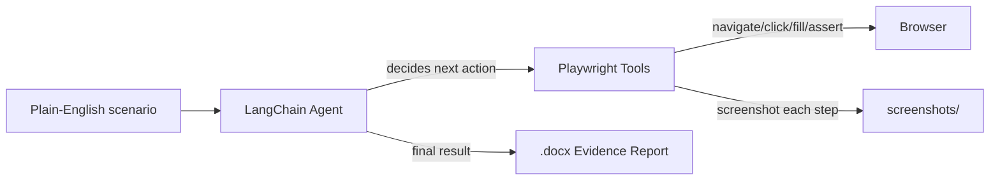
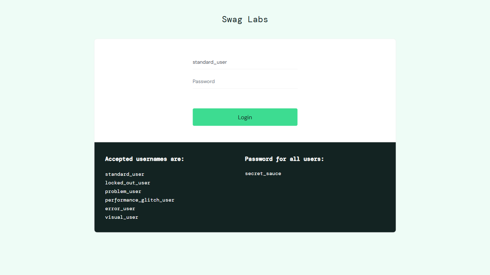
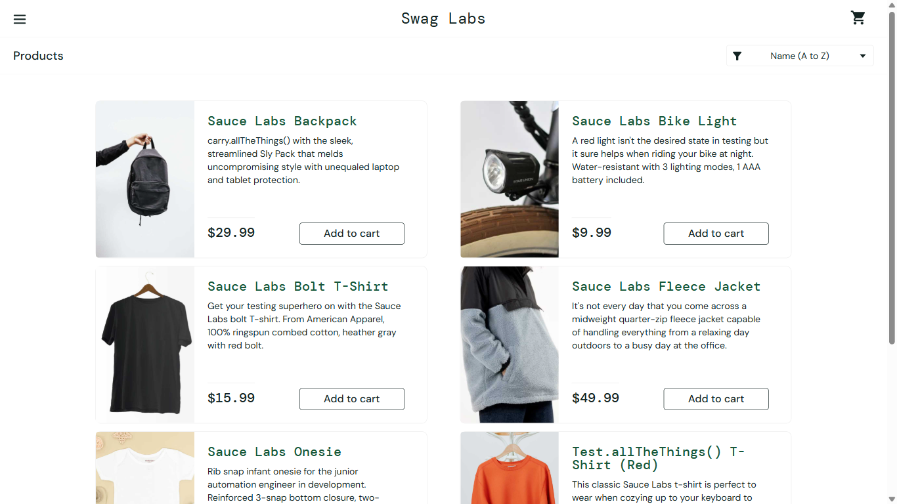

# Agentic QA Automation Engine

Natural-language-driven QA automation. Describe a test scenario in plain English,
and an AI agent (LangChain + your choice of LLM) drives a real browser via
Playwright, validates outcomes, captures a screenshot at every step, and
generates a `.docx` evidence report.

## How it works



## Setup

1. Create and activate a virtual environment:
   ```powershell
   python -m venv .venv
   .\.venv\Scripts\Activate.ps1
   ```
2. Install dependencies:
   ```powershell
   pip install -r requirements.txt
   playwright install chromium
   ```
3. Copy `.env.example` to `.env`:
   ```powershell
   Copy-Item .env.example .env
   ```
4. Edit `.env`:
   - Set `LLM_PROVIDER` to `anthropic`, `gemini`, or `ollama`
   - Fill in the matching API key (`ANTHROPIC_API_KEY` or `GOOGLE_API_KEY`), or install/pull a model locally via `ollama pull llama3.1`
   - Set `APP_BASE_URL`, `TEST_USERNAME`, `TEST_PASSWORD` to your target test application

## Run

```powershell
python main.py "Open the browser, navigate to https://www.saucedemo.com, login with username standard_user and password secret_sauce, verify the Products page loaded, and close the browser."
```

If no scenario is passed as an argument, a default sample scenario runs.

## Example run (SauceDemo login test)

Scenario used: *"Open the browser, navigate to https://www.saucedemo.com, login
with username standard_user and password secret_sauce, verify the Products
page loaded, and close the browser."*

| Step | Screenshot |
|---|---|
| 1. Launch browser |  |
| 2. Navigate to SauceDemo |  |
| 3. Enter username |  |
| 4. Enter password |  |
| 5. Click login |  |
| 6. Verify Products page |  |

Each run also produces a full `.docx` evidence report in `reports/` containing
every step, its pass/fail status, and the corresponding screenshot.

## Output

- `screenshots/` - a screenshot per executed step (overwritten each run)
- `reports/` - a timestamped `.docx` evidence report per run

## Project Structure

- `agent/tools.py` - Playwright-backed tools (navigate, click, fill, assert, screenshot) exposed to the LLM
- `agent/qa_agent.py` - LangChain agent setup; supports `anthropic`, `gemini`, and `ollama` via `LLM_PROVIDER`
- `reporting/report_generator.py` - builds the Word evidence document
- `main.py` - async CLI entry point

## LLM provider notes

| Provider | Cost | Reliability for multi-step flows |
|---|---|---|
| Anthropic Claude | Pay-as-you-go | High |
| Google Gemini | Free tier (rate-limited, e.g. 20 req/day on some models) | High |
| Local Ollama (e.g. `llama3.1:8b`) | Free | Low - tends to skip steps or fabricate results on longer flows |

For trustworthy evidence reports, prefer a cloud model (Anthropic or Gemini).
Local models are best used for quick, single-step sanity checks.

## Troubleshooting

- **`python`/`ollama` not recognized in a new terminal**: refresh PATH in that
  session with:
  ```powershell
  $env:PATH = [System.Environment]::GetEnvironmentVariable("PATH","Machine") + ";" + [System.Environment]::GetEnvironmentVariable("PATH","User")
  ```
- **Gemini `429 RESOURCE_EXHAUSTED`**: free-tier daily quota hit; wait for
  reset, enable billing, or switch `LLM_PROVIDER` temporarily.


Execution Steps

Steps to run the QA agent yourself
1. Open a terminal and navigate to the project:

cd C:\HandHeldRepos\agentic-qa-engine

2. Fix PATH (only needed if python isn't recognized — do this once per new terminal):

$env:PATH = [System.Environment]::GetEnvironmentVariable("PATH","Machine") + ";" + [System.Environment]::GetEnvironmentVariable("PATH","User")

3. Activate the virtual environment:

.\.venv\Scripts\Activate.ps1

Your prompt should now show (.venv) at the start.

4. Run a scenario (your .env already has LLM_PROVIDER=gemini and the API key/target app configured):

python main.py "Open the browser, navigate to https://www.saucedemo.com, login with username standard_user and password secret_sauce, verify the Products page loaded, and close the browser."

Replace the quoted text with any scenario you want to test.

5. Check the results:

Console output shows a step-by-step summary
screenshots/ folder — one image per step
reports/ folder — a .docx evidence report per run (newest file = latest run)
Quick recap of the whole flow, if starting completely fresh:

cd C:\HandHeldRepos\agentic-qa-engine
$env:PATH = [System.Environment]::GetEnvironmentVariable("PATH","Machine") + ";" + [System.Environment]::GetEnvironmentVariable("PATH","User")
.\.venv\Scripts\Activate.ps1
python main.py "your scenario here in plain English"

That's it — no other setup needed since dependencies, .env, and the Gemini key are already in place.